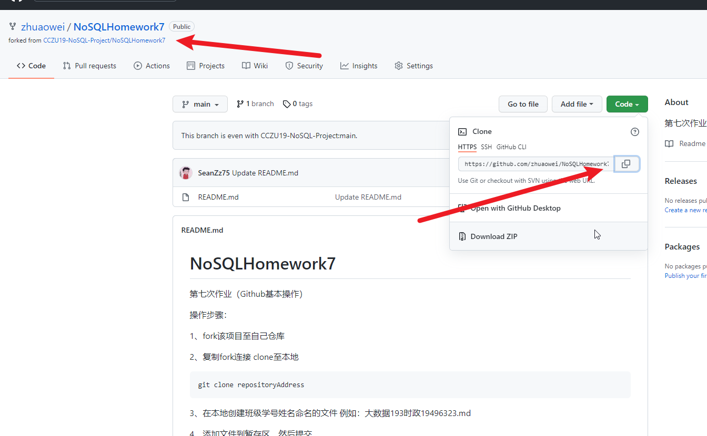
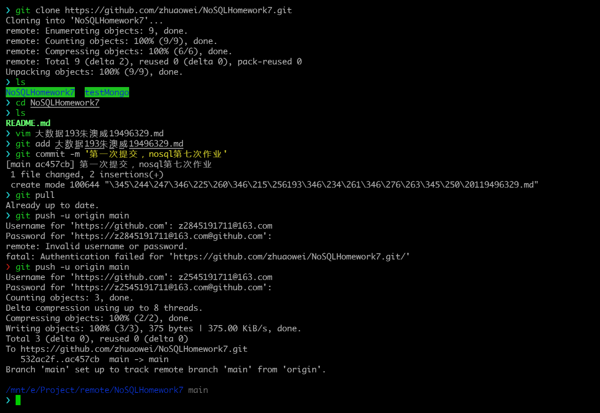
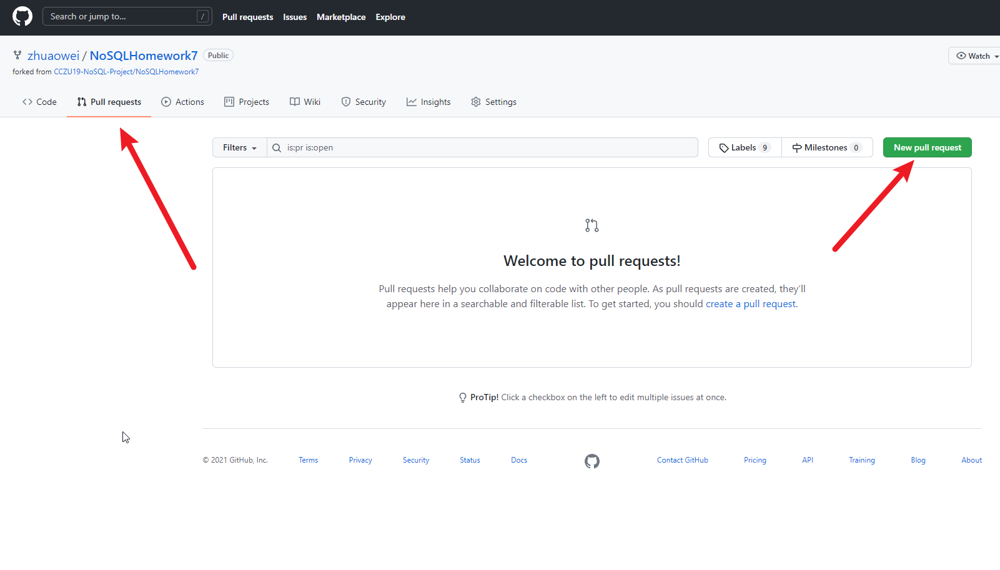
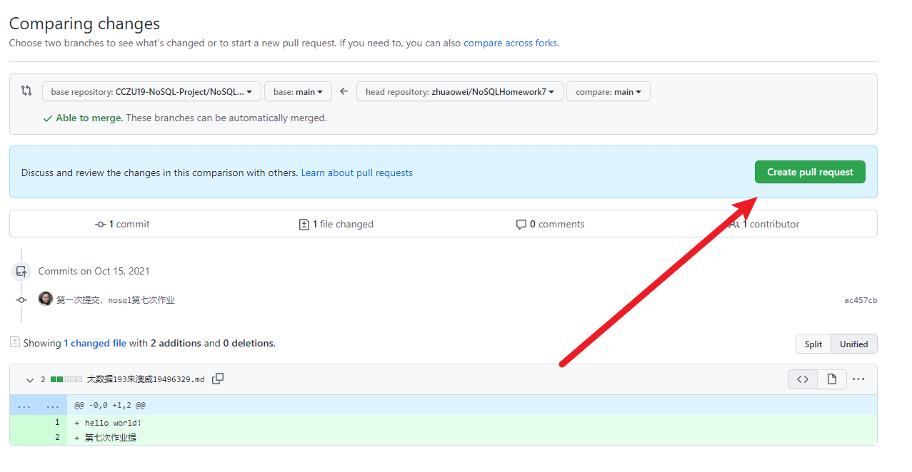
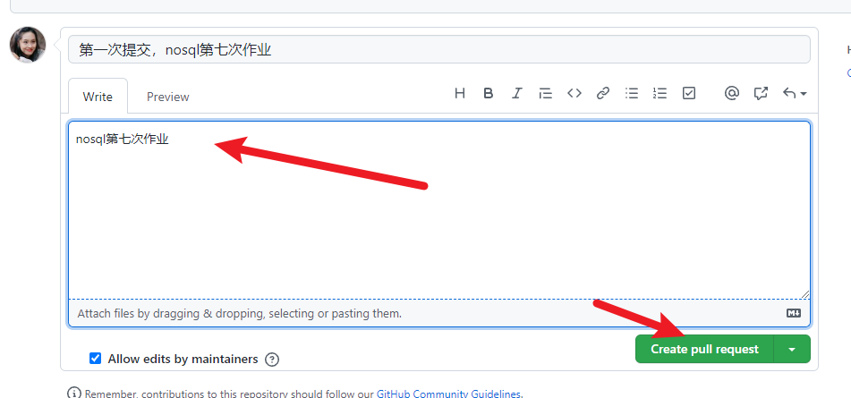

# NoSQLHomework7
第七次作业（Github基本操作）

操作步骤：

1、fork该项目至自己仓库



2、复制fork连接 clone至本地
```
git clone repositoryAddress
```



3、在本地创建班级学号姓名命名的文件 例如：大数据193时政19496323.md



4、添加文件到暂存区，然后提交
```
git add 大数据193时政19496323.md
git commit -m '第一次提交'
git pull
git push -u origin main 

```
> 第一次提交要加 -u



5、在fork的仓库上方选择 pull request，然后创建。


